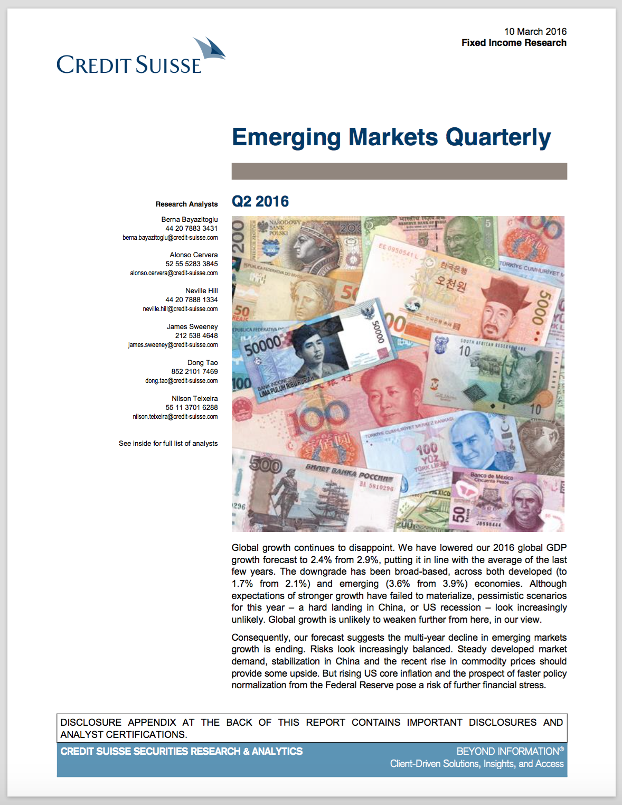
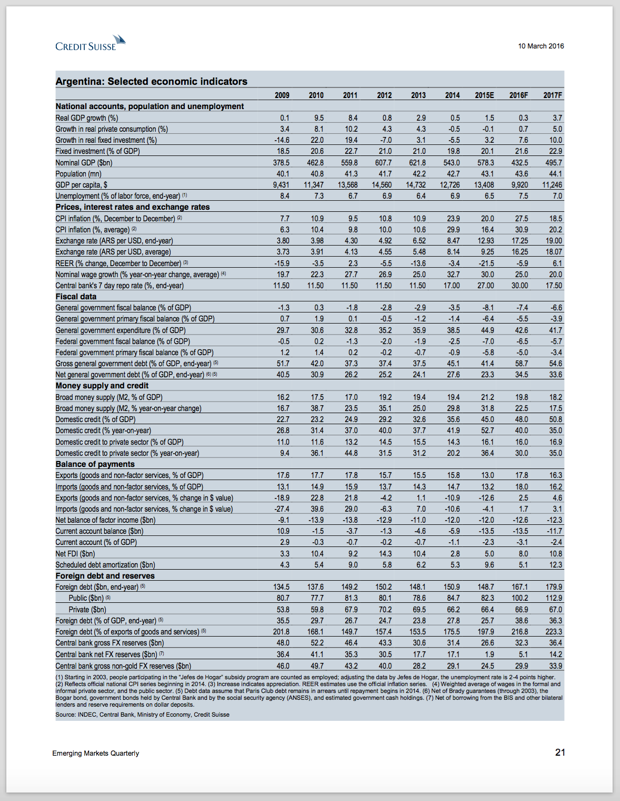

# credit-suisse-monthly-country-economic-indicators-extractor

A friend at [Argo Capital Management](http://www.argocm.com/about-argo), asked me to extract the data from the country economic indicators tables found in his Credit Suisse pdf document (CS2016.pdf). 

Requirements
------------
Java v7 or higher

Shell/git skills to run this app

Usage 
------------
Linux/Mac: Java -jar 
Windows: cs-markets-cei-extractor.exe -pdf_file CS2016.pdf
-pdf_file: (mandatory) pdf file
-page: (optional) page number to extract

Features 
------------
- Pdf extraction with iText
- Regex
- Data sent to Excel using Poi
- Exe package using JSmooth
- User can extract data until he presses 'Q'

Screenshots
------------

TODO List
------------
- [ ] Finish readme
- [ ] Add Screenshots
- [ ] Add jsmooth, exe package
- [ ] Add Usage
- [ ] More testing... file exist, page in range of doc, etc

Changelog
------------
