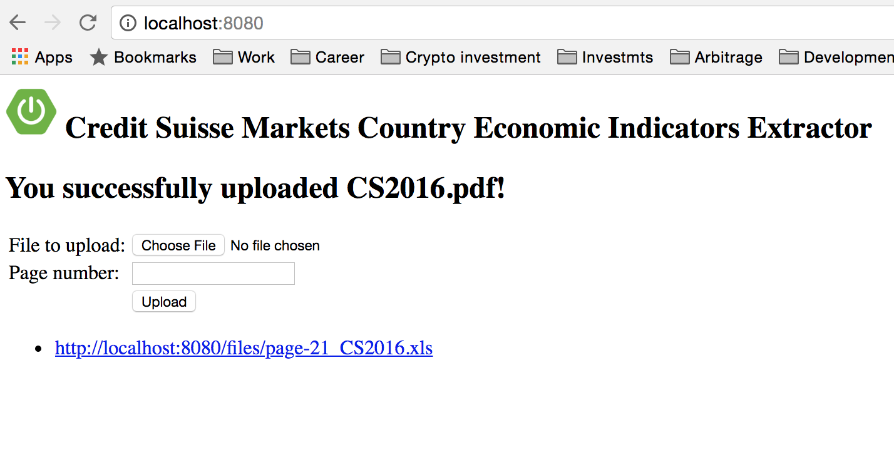

# credit-suisse-monthly-country-economic-indicators-extractor

A friend at [Argo Capital Management](http://www.argocm.com/about-argo), asked me to extract the data from the country economic indicators tables found in his Credit Suisse pdf document (CS2016.pdf). I created a JSmooth wrapper standalone application and a Spring boot application.

Requirements
------------
Java v8 or higher, No Java required on Windows run the executable.

Shell/git skills to run this app

Credit Suisse pdf document with key tables

The Excel file is generated in the project folder. In Spring boot the Excel file can be downloaded. 

Features 
------------
- Pdf extraction with iText
- Regex
- Data sent to Excel using Poi
- Exe package using JSmooth (to be used in Windows)
- User can extract data until he presses 'Q' to quit
- Spring boot application version (I reused the code for the upload from spring.io: https://spring.io/guides/gs/uploading-files/)

Spring boot first App Run  
-------------------------
mvn clean install 

mvn --projects spring-boot-credit-suisse-monthly-country-economic-indicators-extractor spring-boot:run

Then open your browser at: http://localhost:8080

Running the Standalone app
--------------------------
On Linux/Mac: Open a Terminal and run: java -jar [ ] -pdf_file CS2016.pdf -page 9

On Windows: Open a cmd window and run: cs-markets-cei-extractor.exe -pdf_file CS2016.pdf

-pdf_file: (mandatory) pdf file

-page: (optional) page number to extract

TODO List
------------
- [ ] Finish readme
- [x] Add Screenshots
- [x] Add jsmooth, exe package
- [x] Add Usage
- [ ] Refactor code
- [ ] Add Heroku deployment
- [ ] More testing... file exist, page in range of doc, etc

Screenshots
------------

Spring boot application

Standalone application

Changelog
------------
